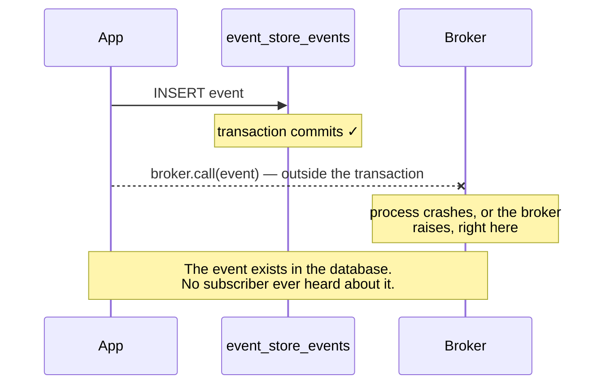
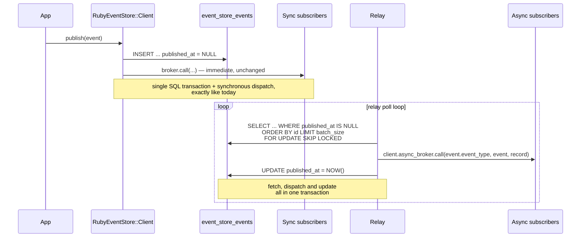
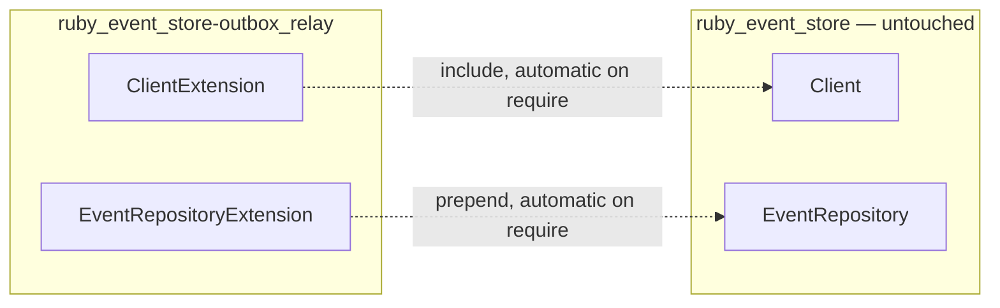
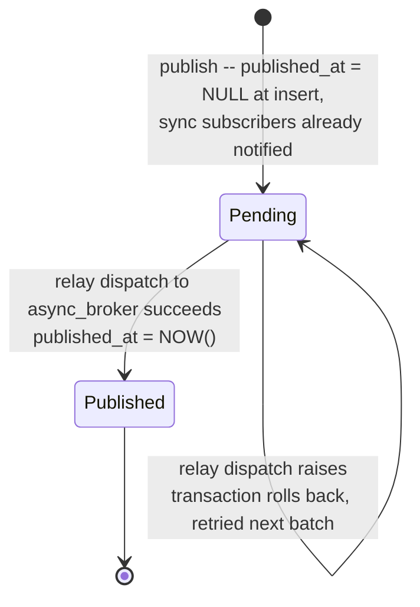
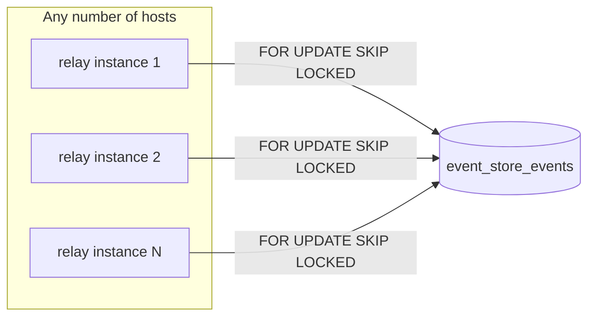

The `ruby_event_store-outbox_relay` gem closes a small but real gap in the default publishing flow: the moment between saving an event and notifying its subscribers, where a crash or a broker failure can leave an event persisted but never delivered.

It does this with one column, two kinds of subscription, and one independent process — no second table to keep in sync, no background-job format of its own.

## The problem it solves

By default, `Client#publish` does two things in sequence: it saves the event, and then — synchronously, in the same process, but **outside the database transaction** — it calls your message broker to notify subscribers.



For most events this window is negligible and the simplicity of synchronous dispatch is worth it — that's why it stays the default. But for events where losing a notification is expensive (billing, fulfillment, cross-service integration), you want the write and the "this needs to be delivered" intent to be atomic.

## The design

A `published_at` column is added to `event_store_events`. Every published event is written with `published_at: NULL`, **inside the same INSERT** that persists it — not as a special case, unconditionally. Delivery is decided per *subscriber*, not per event:

- **`subscribe_sync`** (identical to the original `subscribe`, kept as a working alias) — called immediately, in-process, inside `publish` — exactly the synchronous path shown above, untouched.
- **`subscribe_async`** — never called by `publish`. Delivered exclusively by the **relay**, a separate process that polls for `published_at IS NULL`, dispatches to async subscribers through a second broker, and stamps `published_at` once dispatch succeeds.



The critical design choice: **the relay never writes an event, never touches `publish`.** Its only write to the database, ever, is that one `UPDATE published_at` — everything else about the event was already decided at the moment it was saved.

### Zero changes to `ruby_event_store`

None of this is part of `RubyEventStore::Client` or `RubyEventStore::ActiveRecord::EventRepository` — neither gem is modified. It's added at runtime via `Module#prepend`/`Module#include`, the same mechanism `ruby_event_store` uses internally for its own deprecation wrappers (`RubyEventStore::Deprecations.deprecate`). Both extensions are applied the moment `ruby_event_store/outbox_relay` is required — in one place, side by side (see [Installation](#installation)), so the client and the repository stay in lockstep rather than one being opt-in and the other automatic.



Neither extension is inert: as soon as the gem is required, every `RubyEventStore::Client` (and subclass, e.g. `RailsEventStore::Client`) gains `subscribe_sync`/`subscribe_async`/`async_broker`, and every `RubyEventStore::ActiveRecord::EventRepository` writes every event with `published_at: NULL` unconditionally — whether or not you ever call `subscribe_async`. This is deliberate: any event might later gain an async subscriber, so there's no conditional path to opt out of per write. The practical consequence is that requiring this gem without running a relay leaves every subsequently written event permanently `published_at: NULL` — harmless for the column itself, but worth knowing before you add the gem to your Gemfile "just in case."

### Why no event is ever delivered twice

`subscribe_sync` and `subscribe_async` register handlers on two entirely separate brokers — the client's own `@broker` (used only by `publish`, for sync/`Within` subscribers) and the public `async_broker` (used only by the relay). A handler lives in exactly one of those registries, so it is either called synchronously by `publish` or asynchronously by the relay — never both, and never neither. `published_at: NULL` on every event is simply what makes an event visible to the relay at all; an event with no async subscribers just gets picked up, dispatched to nobody, and marked published on the next pass.

### The `published_at` lifecycle



## Guarantees

| Property | How it's provided |
| --- | --- |
| **Atomicity** | Event row and its "needs delivery" state are written in one INSERT — no window where one exists without the other. |
| **At-least-once delivery for async subscribers** | A raised exception during dispatch rolls back the whole batch transaction; `published_at` stays `NULL` and the event is retried on the next poll. |
| **Exactly-once dispatch per subscriber** | Sync and async subscribers are disjoint sets on two different brokers — a handler is called by `publish` or by the relay, never both. |
| **No duplicated work across relay instances** | `SELECT ... FOR UPDATE SKIP LOCKED` lets multiple relay processes run concurrently without claiming the same batch. |
| **Metadata parity with synchronous publish** | The relay reproduces `correlation_id`/`causation_id` through the same `with_metadata` mechanism `Client#publish` uses, so a handler can't tell which path an event took by inspecting its metadata. |

At-least-once means your async subscribers **must be idempotent by `event_id`** — the same requirement any at-least-once messaging system carries. This is a property of the guarantee, not a gap in the implementation.

## Installation

Add the gem:

```ruby
gem "ruby_event_store-outbox_relay"
```

Generate and run the migration. It adds `published_at` (nullable, defaulting to the current database time) and an index tuned per adapter — a partial index (`WHERE published_at IS NULL`) on PostgreSQL, a composite `(published_at, id)` index on MySQL, since MySQL doesn't support partial indexes.

```
bundle exec rake ruby_event_store:outbox_relay:install_migration
bin/rails db:migrate
```

Because the default backfills every existing row with the current timestamp, your entire event history counts as already published the moment the migration runs — the relay will never try to redeliver it on first deploy.

Requiring the gem is all it takes — no opt-in call. Loading `ruby_event_store/outbox_relay` extends `RubyEventStore::Client` (and therefore every subclass, including `RailsEventStore::Client`) and `RubyEventStore::ActiveRecord::EventRepository` in one place, so the client and the repository are always extended together. Every client gains `subscribe_sync`/`subscribe_async`/`async_broker`; every event is written unpublished.

## Sync and async subscribers

Nothing to wire up — just build a client and register handlers on whichever path fits them:

```ruby
event_store = RailsEventStore::Client.new

event_store.subscribe_sync(OrderMailer, to: [OrderPlaced])       # immediate, in-process
event_store.subscribe_async(OrderReportJob, to: [OrderPlaced])   # via the relay, by default ActiveJob

event_store.publish(OrderPlaced.new(data: { order_id: order.id }))
# OrderMailer runs right here. OrderReportJob runs once the relay processes this
# event -- see "Configuring and running the relay" below.
```

`subscribe` keeps working exactly as it always has (it's an alias for `subscribe_sync`), so existing subscriptions need no changes.

One asymmetry between the two: `subscribe_sync` accepts a block subscriber, `subscribe_async` does not. A block is an anonymous `Proc`, which can't be serialized for ActiveJob (or any other asynchronous processor), so `subscribe_async`'s signature requires a named, resolvable class and rejects a block-only call outright.

### Customizing the async broker

`async_broker` defaults to `RubyEventStore::ImmediateDispatcher` scheduling through `RailsEventStore::ActiveJobScheduler`, reusing the repository's own serializer — so `subscribe_async` handlers must be `ActiveJob` classes by default. To use a different transport, pass `async_broker:` at construction time — this works on `RailsEventStore::Client` and on plain `RubyEventStore::Client` alike:

```ruby
RailsEventStore::Client.new(async_broker: RubyEventStore::Broker.new(dispatcher: MyOwnDispatcher.new))
```

## Configuring and running the relay

The relay reads its broker, mapper, and serializer straight from a `Client` you hand it — there's no separate broker to keep in sync by hand.

```ruby
# config/outbox_relay.rb
require "ruby_event_store/outbox_relay"

RubyEventStore::OutboxRelay::Configuration.configure do |batch_size:, poll_interval:, logger:|
  client = RailsEventStore::Client.new
  client.subscribe_async(OrderReportJob, to: [OrderPlaced])
  client.subscribe_async(InvoiceGenerator, to: [InvoiceGenerationRequested])

  RubyEventStore::OutboxRelay::Relay.new(
    client: client,
    batch_size: batch_size,
    poll_interval: poll_interval,
    logger: logger,
  )
end
```

Only this `client`'s `subscribe_async` registrations matter to the relay (`process_batch` calls `client.async_broker`, nothing else) — any `subscribe_sync` calls on it are simply never triggered by the relay.

Run it as its own process — not a thread inside your web server, not a Puma plugin:

```
bundle exec res_outbox_relay --require=config/outbox_relay.rb --database-url="$DATABASE_URL"
```

A rake task is available too:

```
OUTBOX_RELAY_ARGS="--require=config/outbox_relay.rb --database-url=$DATABASE_URL" \
  bundle exec rake ruby_event_store:outbox_relay:run
```

### Running under systemd

A unit template ships at `support/systemd/res-outbox-relay.service` in the gem, with `Restart=always`. Because the relay always resumes from `published_at IS NULL`, a restart — planned or crash-induced — just picks up wherever it left off; there's no state to reconcile.



Run as many instances as you want, on as many hosts as you want. `SKIP LOCKED` means they never fight over the same batch — throughput scales roughly linearly until you're bottlenecked on the database itself.

### CLI options

| Option | Required | Default | Description |
| --- | --- | --- | --- |
| `--require` | yes | — | Ruby file calling `Configuration.configure` to build the relay |
| `--database-url` | no | — | Database where `event_store_events` is stored |
| `--batch-size` | no | 100 | Number of events fetched per batch |
| `--poll-interval` | no | 1.0 | Seconds to sleep after an empty batch |
| `--log-level` | no | info | One of: `fatal`, `error`, `warn`, `info`, `debug` |

## Requirements

- Ruby >= 3.3
- `ruby_event_store` >= 3.0.0, `ruby_event_store-active_record` >= 3.0.0, `rails_event_store` >= 3.0.0
- PostgreSQL (any supported version), or **MySQL >= 8.0** — `SKIP LOCKED` isn't available on earlier MySQL versions, and the relay's concurrency guarantee depends on it

## Relation to `ruby_event_store-outbox`

Rails Event Store already ships [`ruby_event_store-outbox`](/docs/advanced-topics/outbox), which transactionally enqueues background jobs (Sidekiq) via a dedicated outbox table drained by a `res_outbox` process. `ruby_event_store-outbox_relay` solves an adjacent but distinct problem: it doesn't enqueue jobs onto a table of its own, it delivers events directly to subscribers via a second broker, using a single column on the events table you already have. Pick whichever matches your infrastructure — nothing prevents using both for different events in the same application.
