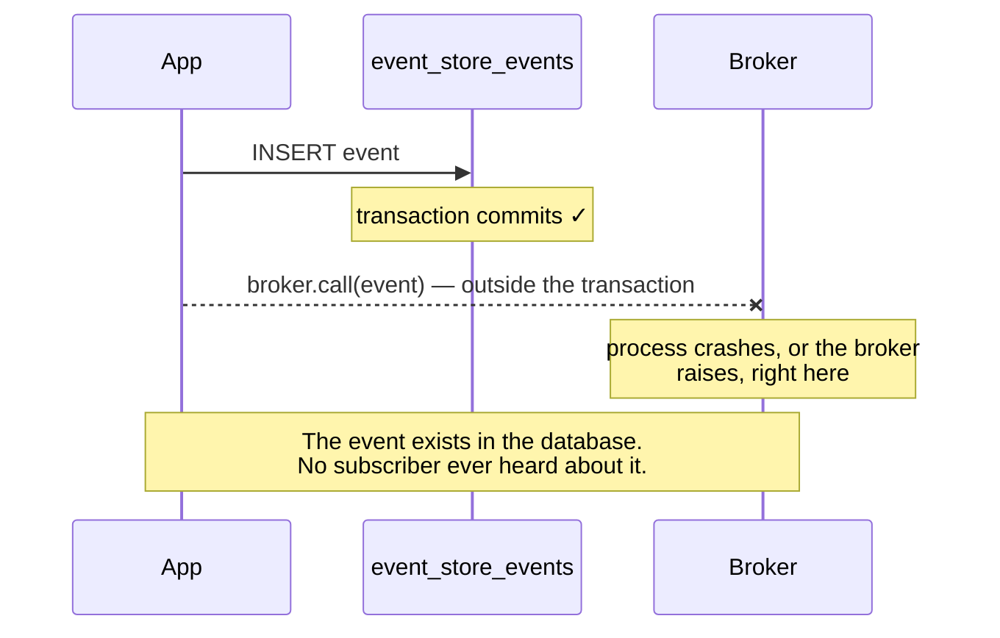
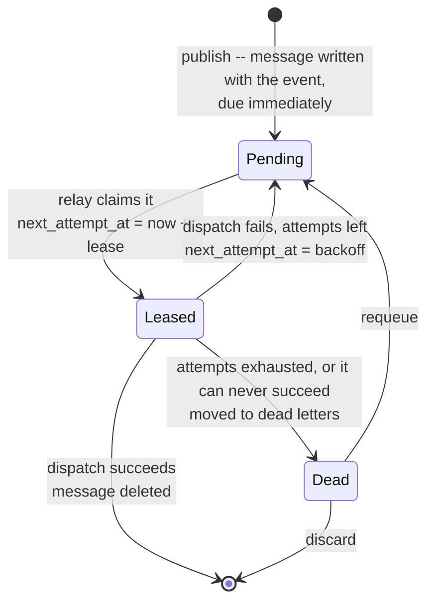
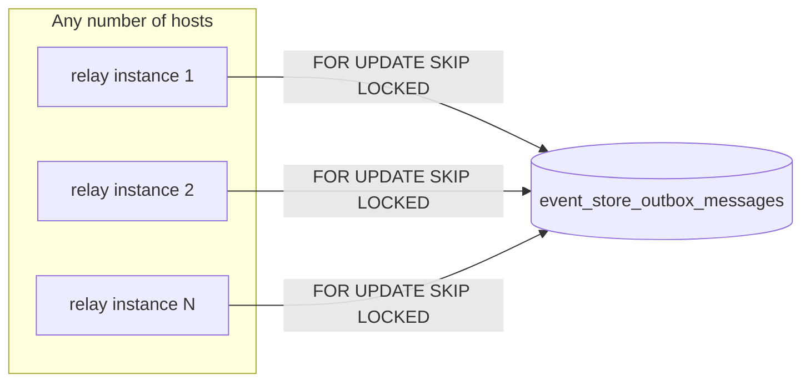

The `ruby_event_store-outbox_relay` gem closes a small but real gap in the default publishing flow: the moment between saving an event and notifying its subscribers, where a crash or a broker failure can leave an event persisted but never delivered.

It does this with two small tables next to `event_store_events`, two kinds of subscription, and one independent process. The events table itself is never altered.

## The problem it solves

By default, `Client#publish` does two things in sequence: it saves the event, and then — synchronously, in the same process, but **outside the database transaction** — it calls your message broker to notify subscribers.


```mermaid
sequenceDiagram
    participant App
    participant DB as event_store_events
    participant Broker

    App->>DB: INSERT event
    Note over DB: transaction commits ✓
    App--xBroker: broker.call(event) — outside the transaction
    Note over Broker: process crashes, or the broker<br/>raises, right here
    Note over App,Broker: The event exists in the database.<br/>No subscriber ever heard about it.
```

For most events this window is negligible and the simplicity of synchronous dispatch is worth it — that's why it stays the default. But for events where losing a notification is expensive (billing, fulfillment, cross-service integration), you want the write and the "this needs to be delivered" intent to be atomic.

## The design

`publish` writes the event and, **in the same transaction**, one **outbox message** per async subscriber of that event. Delivery is decided per *subscriber*, not per event:

- **`subscribe_sync`** (identical to the original `subscribe`, kept as a working alias) — called immediately, in-process, inside `publish`, after the transaction committed — exactly the synchronous path shown above, untouched.
- **`subscribe_async`** — never called by `publish`. Delivered exclusively by the **relay**, a separate process that claims due messages, dispatches them to the async subscribers, and deletes each message once its dispatch succeeded.

```mermaid
sequenceDiagram
    participant App
    participant Client as RubyEventStore::Client
    participant DB as event_store_events + outbox
    participant SyncSub as Sync subscribers
    participant Relay
    participant AsyncSub as Async subscribers

    App->>Client: publish(event)
    Client->>DB: BEGIN; INSERT event; INSERT outbox message per async subscriber; COMMIT
    Client->>SyncSub: broker.call(...) — immediate, unchanged

    loop relay poll loop
        Relay->>DB: claim due messages<br/>FOR UPDATE SKIP LOCKED, move next_attempt_at to the end of a lease
        Note over Relay,DB: short transaction, then no transaction open
        Relay->>DB: read the events
        Relay->>AsyncSub: dispatch each message to its subscriber
        Relay->>DB: DELETE delivered messages — one statement per batch
    end
```

### The tables

- **`event_store_outbox_messages`** holds one row per (event, subscriber): `event_id`, `topic`, `subscriber` (the handler's class name), `attempts`, `next_attempt_at` and `last_error`. It only ever contains work still to do, so it stays small and its index stays hot.
- **`event_store_outbox_dead_letters`** holds deliveries the relay gave up on. See [Dead letters](#dead-letters).

Event types with no async subscribers write no messages, so they cost nothing. The outbox never duplicates event data: the relay reads the event from `event_store_events` when it delivers.

### Why the relay never holds a transaction while delivering

Claiming a batch is one short transaction that only moves each message's `next_attempt_at` to the end of a **lease** (five minutes by default) and returns the rows. Delivery happens afterwards with no transaction open, so:

- a slow or failing subscriber never holds database locks or a connection's transaction;
- a job enqueued by the dispatcher is never deferred until after the message is gone — ActiveJob's `enqueue_after_transaction_commit` has no transaction to wait for, so it enqueues right away;
- other relays skip leased messages, and a relay that crashes mid-batch releases its messages simply by the lease running out.

### No monkeypatching

None of this is part of `RubyEventStore::Client` or `RubyEventStore::ActiveRecord::EventRepository` — neither gem is modified, and requiring the gem changes no existing class. You opt in by building your client from `RubyEventStore::OutboxRelay::Client` (a `RubyEventStore::Client`) or, in Rails, `RubyEventStore::OutboxRelay::RailsClient` (a `RailsEventStore::Client`), subclasses that override `publish` and add `subscribe_sync`/`subscribe_async`/`async_subscriptions`/`outbox`. Until you call `subscribe_async`, `publish` writes no messages and behaves as it always did. The event repository is not touched at all, and `Client#append` keeps its documented contract of notifying no one, so it writes no messages.

The outbox client's `publish` repeats the steps of `RubyEventStore::Client#publish`, and relies on internals of the class to do so. That is why the gem depends on `ruby_event_store` `>= 3.0.0, < 4`, and why a spec fails should one of those internals go.

### Why no event is ever delivered twice by the two paths

`subscribe_sync` and `subscribe_async` register handlers in two entirely separate places — the client's own `@broker` (used only by `publish`, for sync/`Within` subscribers) and `async_subscriptions` (used only by the relay). A handler lives in exactly one of them, so it is either called synchronously by `publish` or asynchronously by the relay — never both.

### The message lifecycle


```mermaid
stateDiagram-v2
    [*] --> Pending: publish -- message written with the event,<br/>due immediately
    Pending --> Leased: relay claims it<br/>next_attempt_at = now + lease
    Leased --> [*]: dispatch succeeds<br/>message deleted
    Leased --> Pending: dispatch fails, attempts left<br/>next_attempt_at = backoff
    Leased --> Dead: attempts exhausted, or it can never succeed<br/>moved to dead letters
    Dead --> Pending: requeue
    Dead --> [*]: discard
```

## Dead letters

A message moves to `event_store_outbox_dead_letters`, in one transaction with its removal from the outbox, when:

- its dispatch keeps failing until `max_attempts` (or fails with an error listed in `permanent_errors`);
- its event is no longer in the event store, or fails to deserialize;
- its subscriber is not registered in the relay process.

The last three can never succeed, so they skip retries. Each dead letter records `event_id`, `topic`, `subscriber`, `attempts`, `error_class`, `error_message` (first 1000 characters), `backtrace` (first 20 lines), `first_enqueued_at` and `dead_at`, and the relay logs an `error` line for it.

```ruby
dead_letters = RubyEventStore::OutboxRelay::DeadLetters.new

dead_letters.count
dead_letters.each { |dead_letter| puts [dead_letter.id, dead_letter.subscriber, dead_letter.error_class].join(" ") }

dead_letters.requeue(id)                         # back to the outbox, attempts reset
dead_letters.requeue_all(topic: "OrderPlaced")   # optionally narrowed by topic and subscriber
dead_letters.discard(id)
```

The same is available as rake tasks:

```
bundle exec rake ruby_event_store:outbox_relay:dead_letters:list
bundle exec rake "ruby_event_store:outbox_relay:dead_letters:retry[42]"
TOPIC=OrderPlaced SUBSCRIBER=OrderReportJob bundle exec rake "ruby_event_store:outbox_relay:dead_letters:retry[all]"
bundle exec rake "ruby_event_store:outbox_relay:dead_letters:discard[42]"
```

### Retries

`RetryPolicy.new(max_attempts: 25, base_delay: 1, max_delay: 3600, jitter: 0.2, permanent_errors: [])` decides when a failed dispatch is retried: after `base_delay * 2^(attempt - 1)` seconds, capped at `max_delay` and stretched by up to `jitter`. With the defaults a message is dead-lettered after roughly 13 hours.

A failing message never blocks the others. It moves out of the way through `next_attempt_at`, and the relay keeps claiming everything else that is due.

## Guarantees

| Property | How it's provided |
| --- | --- |
| **Atomicity** | An event and the outbox messages for its async subscribers are written in one transaction. If either write fails, neither persists, and sync subscribers are not notified. |
| **At-least-once delivery, per subscriber** | A message is deleted only after its dispatch returned. A failure retries only that subscriber's message. A relay that crashes after dispatching but before deleting redelivers once its lease runs out. |
| **Dispatch outside any transaction** | Delivery runs with no transaction open: no locks held during subscriber I/O, and no interaction with `enqueue_after_transaction_commit`. |
| **A message that can't be delivered can't block the queue** | It backs off, then moves to the dead letters. |
| **No duplicated work across relay instances** | `SELECT ... FOR UPDATE SKIP LOCKED` plus leases let multiple relay processes run concurrently without claiming the same message. |
| **Metadata parity with synchronous publish** | The relay reproduces `correlation_id`/`causation_id` through the same `with_metadata` mechanism `Client#publish` uses. |
| **No ordering guarantee** | Messages are claimed oldest first, but with several relays, retries and ActiveJob, handlers can observe events out of order. |

At-least-once means your async subscribers **must be idempotent by `event_id`** — the same requirement any at-least-once messaging system carries. `lease_duration` must comfortably exceed the time to deliver a batch: a shorter lease lets another relay claim a message that is still being delivered.

## Installation

Add the gem:

```ruby
gem "ruby_event_store-outbox_relay"
```

In a Rails application, load the Rails integration too, which defines `RailsClient` and needs `rails_event_store`:

```ruby
gem "ruby_event_store-outbox_relay", require: "ruby_event_store/outbox_relay/rails"
```

Generate and run the migration. It creates the two outbox tables and the index on `(next_attempt_at, id)`; `event_store_events` is not modified.

```
bundle exec rake ruby_event_store:outbox_relay:install_migration
bin/rails db:migrate
```

## Sync and async subscribers

Nothing to wire up — just build a client and register handlers on whichever path fits them:

```ruby
event_store = RubyEventStore::OutboxRelay::RailsClient.new

event_store.subscribe_sync(OrderMailer, to: [OrderPlaced])       # immediate, in-process
event_store.subscribe_async(OrderReportJob, to: [OrderPlaced])   # via the relay, by default ActiveJob

event_store.publish(OrderPlaced.new(data: { order_id: order.id }))
# OrderMailer runs right here. OrderReportJob runs once the relay delivers this
# event's message -- see "Configuring and running the relay" below.
```

`subscribe` keeps working exactly as it always has (it's an alias for `subscribe_sync`), so existing subscriptions need no changes.

Two asymmetries between the two:

- `subscribe_sync` accepts a block subscriber, `subscribe_async` does not. The outbox stores the subscriber's class name, so `subscribe_async` requires a named class and rejects a block or an anonymous class outright.
- **The relay must run with the client of your application.** The application uses the registered subscribers to decide which messages to write; the relay uses them to resolve a message's `subscriber` name back to a handler. The relay resolves names only through this registry — never by constant lookup — so a row in the outbox table can only ever reach a handler you registered. Handing the relay the very client of your application keeps the list of async subscribers in one place.

`publish(event, topic: "custom")` writes messages for the async subscribers of that topic, exactly as it notifies the sync subscribers of that topic.

### Customizing async delivery

`async_subscriptions` defaults to `RubyEventStore::OutboxRelay::ActiveJobDispatcher` with the YAML serializer — so `subscribe_async` handlers must be `ActiveJob` classes by default, and the relay enqueues each batch of jobs at once (see [Throughput](#throughput)). To use a different transport, pass `async_subscriptions:` at construction time:

```ruby
dispatcher = RubyEventStore::ImmediateDispatcher.new(scheduler: MyOwnScheduler.new)
RubyEventStore::OutboxRelay::RailsClient.new(
  async_subscriptions: RubyEventStore::OutboxRelay::AsyncSubscriptions.new(dispatcher: dispatcher),
)
```

## Configuring and running the relay

The relay reads its subscriptions, outbox and mapper straight from a `Client` you hand it — the one of your application, so `subscribe_async` is called in one place only. Point the process at a file that loads the application and builds the relay:

```ruby
# config/outbox_relay.rb
require_relative "environment"

RubyEventStore::OutboxRelay::Configuration.configure do |batch_size:, poll_interval:, logger:|
  RubyEventStore::OutboxRelay::Relay.new(
    client: Rails.configuration.event_store,
    batch_size: batch_size,
    poll_interval: poll_interval,
    logger: logger,
  )
end
```

Only the client's `subscribe_async` registrations matter to the relay — its `subscribe_sync` subscribers are never triggered by it. The relay refuses a client that isn't an outbox client, and at startup it logs the async subscribers of every topic, warning when there are none — in which case every message would be dead-lettered.

Run it as its own process — not a thread inside your web server, not a Puma plugin:

```
DATABASE_URL="postgres://relay@db/app" bundle exec res_outbox_relay --require=config/outbox_relay.rb
```

A rake task is available too:

```
DATABASE_URL="postgres://relay@db/app" OUTBOX_RELAY_ARGS="--require=config/outbox_relay.rb" \
  bundle exec rake ruby_event_store:outbox_relay:run
```

### `Relay` options

| Option | Default | Description |
| --- | --- | --- |
| `batch_size` | 100 | Messages claimed per batch |
| `poll_interval` | 1 | Seconds to sleep when nothing was due |
| `lease_duration` | 300 | Seconds a claimed message stays hidden from other relays |
| `retry_policy` | `RetryPolicy.new` | When to retry a failed dispatch and when to give up |

### Running under systemd

A unit template ships at `support/systemd/res-outbox-relay.service` in the gem, with `Restart=always`. A restart — planned or crash-induced — just picks up wherever it left off: unfinished messages come back once their lease runs out, and there's no other state to reconcile.


```mermaid
flowchart LR
    subgraph hosts [Any number of hosts]
        R1[relay instance 1]
        R2[relay instance 2]
        R3[relay instance N]
    end
    DB[(event_store_outbox_messages)]
    R1 -- "FOR UPDATE SKIP LOCKED" --> DB
    R2 -- "FOR UPDATE SKIP LOCKED" --> DB
    R3 -- "FOR UPDATE SKIP LOCKED" --> DB
```

Run as many instances as you want, on as many hosts as you want. `SKIP LOCKED` means they never fight over the same messages — throughput scales roughly linearly until you're bottlenecked on the database itself.

### CLI options

The database is taken from the `DATABASE_URL` environment variable, never from an argument — see [Security](#security).

| Option | Required | Default | Description |
| --- | --- | --- | --- |
| `--require` | yes | — | Ruby file calling `Configuration.configure` to build the relay |
| `--batch-size` | no | 100 | Number of messages claimed per batch |
| `--poll-interval` | no | 1.0 | Seconds to sleep when nothing was due |
| `--log-level` | no | info | One of: `fatal`, `error`, `warn`, `info`, `debug` |

## Observability

The relay reports through `ActiveSupport::Notifications`, under names ending in `.outbox_relay.ruby_event_store`. Pass another object responding to `instrument(name, payload)` as `instrumentation:` to send them elsewhere. Without subscribers they cost next to nothing.

| Notification | When | Payload |
| --- | --- | --- |
| `process_batch` | around each batch, idle ones included | `claimed`, `delivered`, `retried`, `dead` |
| `message_failed` | for each message that failed to be delivered | `outbox_id`, `event_id`, `topic`, `subscriber`, `attempts`, `error_class`, `outcome` (`:retried` or `:dead`) |
| `stats` | every `stats_interval` seconds (30 by default, `nil` turns it off) | `backlog`, `oldest_due_age`, `dead_letters` |

`message_failed` never carries the error's message, which can echo event data. The duration of a batch is the duration of its notification.

```ruby
ActiveSupport::Notifications.subscribe("process_batch.outbox_relay.ruby_event_store") do |event|
  StatsD.measure("outbox.batch", event.duration)
  StatsD.increment("outbox.delivered", event.payload[:delivered])
end

ActiveSupport::Notifications.subscribe("stats.outbox_relay.ruby_event_store") do |event|
  StatsD.gauge("outbox.oldest_due_age", event.payload[:oldest_due_age].to_f)
  StatsD.gauge("outbox.dead_letters", event.payload[:dead_letters])
end
```

`backlog` is the number of messages that are due, `oldest_due_age` the seconds the oldest of them has waited (`nil` when none is due) and `dead_letters` the number of dead letters. The two counts stop at 10,000, so measuring a huge backlog stays cheap. Messages being delivered are leased, hence not due. Alert on `oldest_due_age` growing, and on any `dead_letters`: they say the relay isn't keeping up, or that something can't be delivered. The same numbers are available to your own endpoint from `client.outbox.stats(now: Time.now.utc)`.

The relay logs, at `info`, its startup and shutdown and the async subscribers of every topic; at `warn`, each retry; at `error`, each dead letter, and a batch or stats query that failed, by exception class only; at `debug`, the counts of each batch that claimed something, and the message and backtrace of a failed batch.

## Throughput

Numbers below come from a laptop, a local PostgreSQL and the default YAML serializer, so read them as proportions, not promises.

- **Publishing.** A `publish` of events with async subscribers issues exactly one more statement than without them — one `INSERT` of the outbox messages, whatever the number of events published together, and none of it outside the transaction you already have. Publishing a batch amortizes even that. The events table is never updated afterwards, so it stays append-only.
- **One relay process** delivers about 8,000 messages per second to a subscriber that does nothing, and about 1,600 per second through ActiveJob. In the ActiveJob case most of the time goes to serializing each event for the job payload (a YAML dump of its metadata), not to the queue or the database. The relay is CPU-bound, so throughput scales with the number of relay processes, which share the outbox through `SKIP LOCKED`.
- **Bulk enqueue.** `ActiveJobDispatcher`, the default, enqueues a whole batch with a single `ActiveJob.perform_all_later`, which adapters turn into one round trip instead of one per job. With a simulated 0.2 ms round trip to the queue it raised throughput from about 1,070 to 1,740 messages per second for one subscriber per event, and from about 1,820 to 4,560 for three. With an in-memory adapter there is nothing to save. `perform_all_later` skips the enqueue callbacks (`before_enqueue`, `around_enqueue`, `after_enqueue`), so jobs that define any are enqueued one by one, with their callbacks. The adapter must mark the jobs it enqueued (`job.successfully_enqueued`), as ActiveJob's own adapters do. A dispatcher of your own gets the same treatment by responding to `call_all`, which takes an array of `AsyncSubscriptions::Delivery` and returns, for each, the error that kept it from being delivered, or `nil`.
- **Batch size and lease.** A bigger `batch_size` amortizes the claim and the delete, but beyond a few hundred it stops paying off, and a slow batch needs a longer `lease_duration`.
- **An idle relay** costs one short transaction per `poll_interval`. It sleeps only when nothing was due, so under load it never waits.

## Security

- **Database credentials never travel as arguments.** The relay reads the database from the `DATABASE_URL` environment variable; there is deliberately no `--database-url` option, because arguments are visible to every local user in the process list, `/proc/*/cmdline` and the journal. Under systemd, keep the variable in an `EnvironmentFile=` readable by root only (`chmod 600`), as the shipped unit does. `OUTBOX_RELAY_ARGS` of the rake task is split like a shell would.
- **Least privilege.** The relay only needs (verified on PostgreSQL) `SELECT` on `event_store_events`, `SELECT`, `UPDATE` and `DELETE` on `event_store_outbox_messages`, and `INSERT` on `event_store_outbox_dead_letters`. The application only needs `INSERT` on `event_store_outbox_messages`, on top of what it already has for the event store. Inserts never ask for the generated id (`RETURNING`), so no `SELECT` is needed on tables that are only written. Give the relay its own database role, and a separate one to whoever runs the dead letter tasks (`SELECT`, `UPDATE` and `DELETE` on the dead letters, because requeueing locks them with `FOR UPDATE`, and `INSERT` on the messages).
- **Only registered subscribers are ever called.** A message stores a subscriber's class name, but the relay resolves it through the `subscribe_async` registry only, never by constant lookup, so a row written to the outbox table cannot make it call an arbitrary class.
- **Deserialization is the relay's biggest attack surface.** The relay deserializes events read from the database with the repository's serializer. `RubyEventStore::Serializers::YAML`, the default of `RailsEventStore::Client`, loads with `YAML.unsafe_load`: anyone able to write to `event_store_events` (for example through an SQL injection elsewhere, or another service sharing the database) could make the relay, which holds database credentials and access to your job queue, execute code. Prefer the `JSON` serializer, and restrict write access to the events table to the applications that publish.
- **Logs stay free of event data.** A failing batch is logged by exception class only, and a failed or dead-lettered delivery by message id, event id, subscriber and exception class. The exception's message and backtrace are logged at `debug` level. Note that `last_error` on a message and `error_message` on a dead letter store the exception's message (truncated to 1000 characters), which can echo event data: treat both tables with the sensitivity of `event_store_events`.
- **Signal handlers are chained.** The relay handles `INT` and `TERM` to shut down gracefully and still calls any handler installed before it.
- **Hardened unit.** `support/systemd/res-outbox-relay.service` drops all capabilities, forbids privilege escalation and runs with a read-only file system, a private `/tmp`, no devices and restricted address families.

## Requirements

- Ruby >= 3.3
- `ruby_event_store` and `ruby_event_store-active_record` >= 3.0.0 and < 4
- `activerecord` and `activejob` >= 7.1
- `rails_event_store` >= 3.0.0, only for `RailsClient`
- PostgreSQL (any supported version), or **MySQL >= 8.0** — `SKIP LOCKED` isn't available on earlier MySQL versions, and the relay's concurrency guarantee depends on it. SQLite works for a single relay instance only, since it has no row locks.

## Relation to `ruby_event_store-outbox`

Rails Event Store already ships [`ruby_event_store-outbox`](/docs/advanced-topics/outbox), which transactionally enqueues background jobs (Sidekiq) via a dedicated outbox table drained by a `res_outbox` process. `ruby_event_store-outbox_relay` solves an adjacent but distinct problem: it doesn't enqueue jobs in a format of its own, it delivers events directly to subscribers through a dispatcher, with per-subscriber retries and a dead letter table. Pick whichever matches your infrastructure — nothing prevents using both for different events in the same application.
